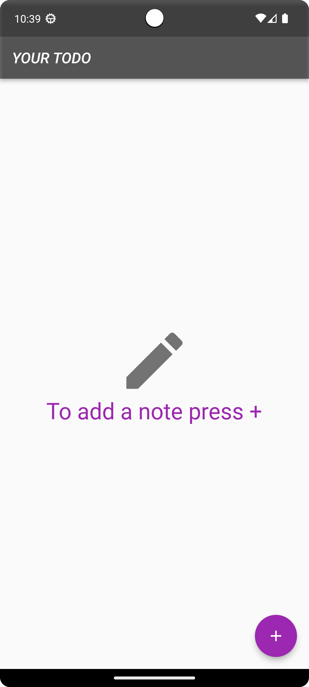
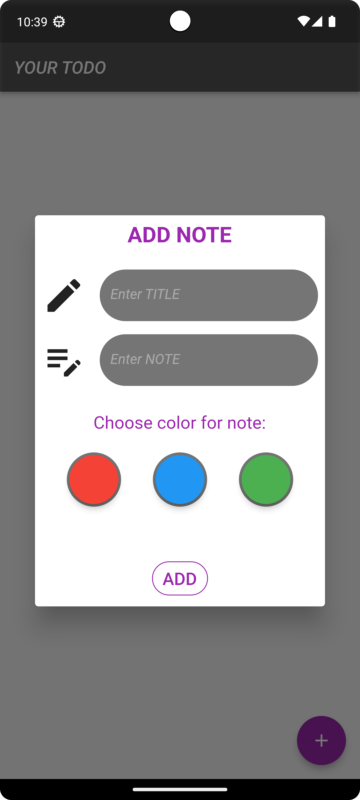
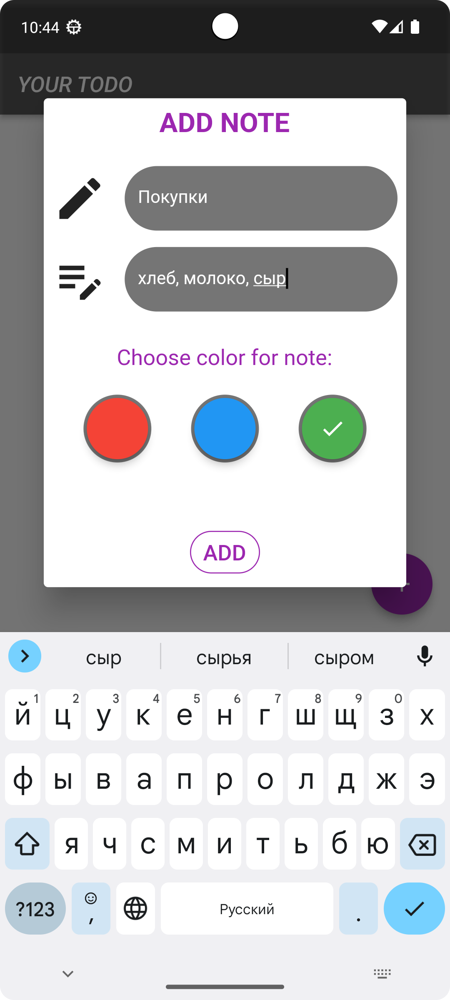

# you_todo_homework

# Описание проекта

**Проект самой простой записной книжки, который создавался с целью закрепления знаний пакета BloC и пакета SQL, фрэймворк Flutter.**

|              Главное меню              |           Создание записи           |              Ввод текста              | 
|:--------------------------------------:|:-----------------------------------:|:-------------------------------------:|
|  |   |   | 

|              Созданные записи              |           Несколько записей           |             Обновление записи              |
|:------------------------------------------:|:-------------------------------------:|:------------------------------------------:|
|   |   |   |